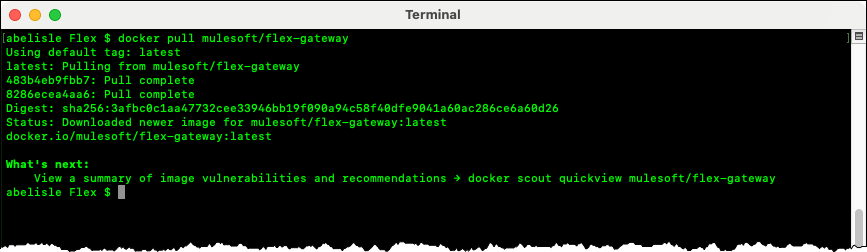
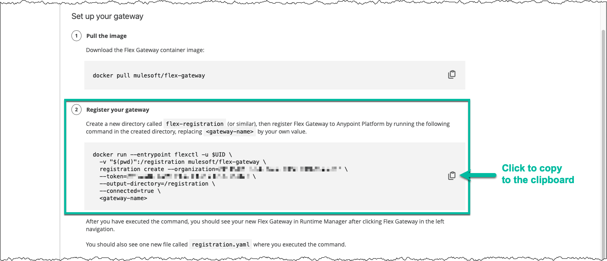
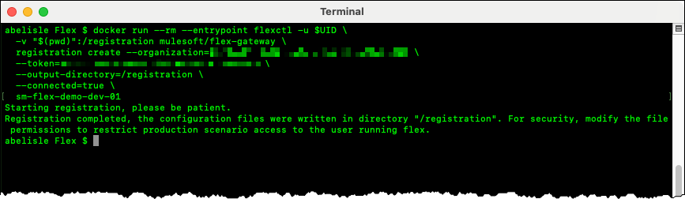

Flex Gateway on ACA Informal Guide
===========================================================

## Table of Contents

- [Introduction](#introduction)
  - [Scope](#scope)
  - [Prerequisites](#prerequisites)
  - [Terminology](#terminology)
- [Running Flex Gateway on Azure Container Apps](#running-flex-gateway-on-azure-container-apps)
  - 
- [Conclusion](#conclusion)

<p>&nbsp;</p>

# Introduction
This informal guide provides a suggested approach to establish a baseline or foundation for deploying and running Anypoint Flex Gateway in Connected mode on Azure Container Apps (ACA).

## Scope

This guide and the suggested approach were tested using Flex Gateway versions 1.8.3 and 1.9.3 running in Connected Mode. The current revision utilizes the `FLEX_CONFIG` environment variable, introduced in version 1.7.0, and the [Readiness Probe](https://docs.mulesoft.com/gateway/latest/flex-conn-readiness-liveness#configure-external-components), introduced in version 1.8.0. Therefore, the content applies to Flex Gateway versions 1.8.0 and above. 

Although this guide primarily focuses on running Flex Gateway in [Connected Mode](https://docs.mulesoft.com/gateway/latest/#connected_mode), most of the content still applies if you have experience running Flex Gateway in [Local Mode](https://docs.mulesoft.com/gateway/latest/#local_mode).

Finally, the scope is intentionally limited to establishing a baseline or minimal installation and configuration of Flex Gateway on Azure Container Apps. This guide does not cover advanced topics such as creating a dedicated Azure Virtual Network (VNet), high availability, securing and hardening Azure resources, Flex Gateway, and any APIs it manages.

## Approach Overview
The suggested approach herein leverages the Azure command-line interface (CLI) for provisioning and configuring Azure resources. However, assuming you have experience provisioning and configuring Azure resources, you can complete all the steps using the Azure portal or leverage an Infrastructure as Code (IaC) approach, such as Azure Resource Manager, Ansible, or Terraform.

Furthermore, this guide leverages shell variables whenever possible to store reusable information and eliminate the need for editing commands included in this guide.

> [!NOTE]
> This guide was authored on a Mac computer. If you use a Windows computer, you must adjust the commands in this guide accordingly.

## Prerequisites

- You must have the Azure CLI installed. Please refer to the article [How to install the Azure CLI](https://learn.microsoft.com/en-us/cli/azure/install-azure-cli) in the [Azure Command-Line Interface (CLI) documentation](https://learn.microsoft.com/en-us/cli/azure/?view=azure-cli-latest) for more information.

- You must authenticate to Azure using the Azure CLI. Please refer to the article [Authenticate to Azure using Azure CLI](https://learn.microsoft.com/en-us/cli/azure/authenticate-azure-cli) in the [Azure Command-Line Interface (CLI) documentation](https://learn.microsoft.com/en-us/cli/azure/?view=azure-cli-latest) for more information.

- You must register the resource providers `Microsoft.App` and `Microsoft.OperationalInsights`, typically done via the Aure CLI as follows:

  ```shell
  az provider register --namespace Microsoft.App
  az provider register --namespace Microsoft.OperationalInsights --wait
  ```

- You must have sufficient privileges in your Azure account to create and configure services and resources, including but not limited to resource group, container apps environment, and container.

## Terminology

Before proceeding, it is essential to understand the following terminology used in the context of this document.

|   |   |
| - | - |
| **Flex Gateway Instance** | An instance is a logical entity that groups one or more Flex Gateway replicas. When adding Flex Gateway to Anypoint Runtime Manager, you register a new Flex Gateway instance using the `flexctl` utility, which outputs a registration file. The content of the registration file is specific to the instance you registered and the Anypoint organization or business group and environment where you registered it. |
| **Flex Gateway Replica**  | A replica is a runtime unit or a copy of Flex Gateway running on a supported operating system or infrastructure (e.g., Docker, Podman, Kubernetes, OpenShift). You associate replicas to an instance by running Flex Gateway using the same registration file. You run two or more replicas for each Flex Gateway instance to achieve high availability. |

# Running Flex Gateway on Azure Container Apps

Running Anypoint Flex Gateway on Azure Container Apps is relatively straightforward. There are a few minor gotchas, but nothing complex.

- In step 1, you register the Flex Gateway instance.
- In step 2, you create the Azure resources to run a single Flex Gateway replica, namely:
  - First, although optional, you should create an Azure resource group to hold all resources related to Flex Gateway.
  - Then, you create a container apps environment, "a secure boundary around one or more container apps and jobs" [1].
  - Next, you create a YAML file to describe how to configure the container app for Flex Gateway. This step is unavoidable, as the Azure CLI does not support all the required configurations necessary to run Flex Gateway.
  - Finally, you create the Flex Gateway container app.

## Step 1 - Register Flex Gateway Instance

The easiest approach is to follow the high-level process ***Add a Self-Managed Flex Gateway*** described in **Anypoint Runtime Manager** because it prepopulates values that simplify the efforts significantly. In this guide, however, you only need to complete steps 1 (***Pull the image***) and 2 (***Register your gateway***) as if adding a Flex Gateway instance on Docker to generate the registration file. Before you begin, it is crucial to understand that a Flex Gateway instance is tied to:

1. An Anypoint organization or business group, and
2. An Anypoint environment (e.g., sandbox, production).


In the screen capture above, the **Demo** business group and the **Dev** environment are selected, and the prepopulated values reflect those selections.

### 1.1 - Pull Flex Gateway Docker Image

Step 1 (***Pull the image***) of the **Anypoint Runtime Manager** generic instructions consists of downloading the Flex Gateway Docker image from Docker Hub. You must have Docker installed locally and running (e.g., Docker Desktop) to complete this step and the next.

- Open a terminal (Linux or Mac) and execute the following Docker command.

  ```shell
  docker pull mulesoft/flex-gateway
  ```

  

### 1.2 – Register Flex Gateway Instance

Step 2 (***Register your gateway***) of the **Anypoint Runtime Manager** generic instructions involves running the Docker image to register a new Flex Gateway instance with the Anypoint Platform control plane. As mentioned, the most straightforward approach is to leverage the command generated by Anypoint Runtime Manager, which includes prepopulated values based on the Anypoint organization or business group and the environment selected.

- First, log into the Anypoint Platform (<https://anypoint.mulesoft.com>).

- On the landing page, select **Runtime Manager** in the **Management Center** section on the right.

- In **Runtime Manager**, if applicable, select the root organization or the appropriate business group (top right corner) and the correct environment (top left corner).

- Next, select the **Flex Gateways** option in the left vetical menu.

- On the **Flex Gateways** page, click on the **Self-Managed Flex Gateway** tab.

- Next, click the **Add Self-Managed Flex Gateway** button, click on the **Container** icon, and click the **Docker** logo.

- In the high-level instructions displayed, locate step 2 (***Register your gateway***) and copy the command.

  

- Optionally, paste this command to a text editor to make any necessary changes. Do not forget to replace the `<gateway-name>` placeholder with the name of your instance.

> [!TIP]
> Adding the flag `--rm` before the flag `--entrypoint` disposes of the container automatically once the registration completes, as it is no longer required. Without this flag, the Docker container runs, the process completes, the container stops, and it remains on the system until you delete it, which you often forget to do.

- Finally, paste the command into the terminal (Linux or Mac) and execute it to register your new Flex Gateway instance.

  

The registration command creates a file named `registration.yaml` in the current directory on your computer. This registration file is specific to the Flex Gateway instance you just registered. As a reminder, it is tied to the selected 1) Anypoint organization or business group and 2) Anypoint environment.


## Step 2 - Create Azure Resources

### 2.1 - Create Azure Resource Group


### 2.2 - Create Container Apps Environment


### 2.3 - Create Flex Gateway YAML File


### 2.4 - Create the Flex Gateway Container App


# Conclusion

This informal guide provided a suggested approach to establish a baseline or foundation for deploying and running Anypoint Flex Gateway in Connected mode on Azure Container Apps. In the current revision, the described approach leveraged the `FLEX_CONFIG` environment variable, introduced in version 1.7.0, and the **Readiness Probe**, introduced in version 1.8.0. Therefore, as a reminder, the content only applies to Flex Gateway versions 1.8.0 and above. 

# References

- 1 - https://learn.microsoft.com/en-us/azure/container-apps/environment

