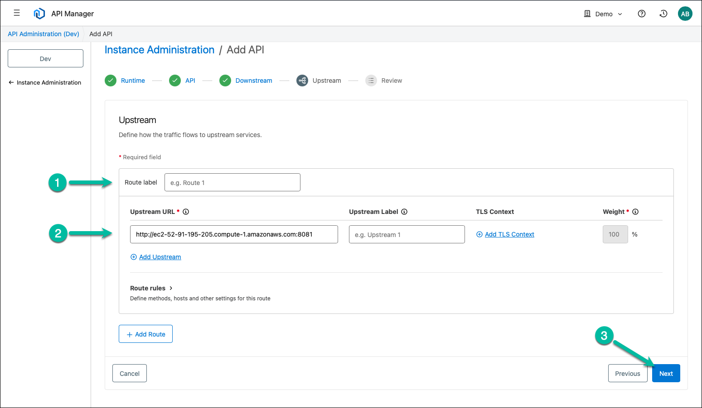

Flex Gateway on ACA Informal Guide
===========================================================

## Table of Contents

- [Introduction](#introduction)
  - [Scope](#scope)
  - [Prerequisites](#prerequisites)
  - [Terminology](#terminology)
- [Running Flex Gateway on Azure Container Apps](#running-flex-gateway-on-azure-container-apps)
  - [Part 1 - Create FLEX_CONFIG Value](#part-1---create-flex_config-value)
  - [Part 2 - Create Azure Resources](#part-2---create-azure-resources)
  - [Part 3 - Enable Ingress for Flex Gateway](#part-3---enable-ingress-for-flex-gateway)
- [Conclusion](#conclusion)

<p>&nbsp;</p>

# Introduction
This informal guide provides a suggested approach to establish a baseline or foundation for deploying and running Anypoint Flex Gateway in Connected mode on Azure Container Apps (ACA).

While authoring this guide, the goal was to focus on a basic deployment with minimal configuration to ensure success. Once you have successfully deployed and run Anypoint Flex Gateway on Azure Container Apps, you can build upon the minimalist configuration and address more advanced requirements (e.g., last-mile security, high availability).

## Scope

This guide and the suggested approach were tested using Flex Gateway versions 1.8.3 and 1.9.3 running in Connected Mode. The current revision utilizes the `FLEX_CONFIG` environment variable, introduced in version 1.7.0, and the [Readiness Probe](https://docs.mulesoft.com/gateway/latest/flex-conn-readiness-liveness#configure-external-components), introduced in version 1.8.0. Therefore, the content applies to Flex Gateway versions 1.8.0 and above. At the time of writing, the current patch releases are 1.8.3 (released on January 29, 2025) and 1.9.4 (released on June 4, 2025). However, this guide was authored using Flex Gateway version 1.8.3. 

Although this guide primarily focuses on running Flex Gateway in [Connected Mode](https://docs.mulesoft.com/gateway/latest/#connected_mode), most of the content still applies if you have experience running Flex Gateway in [Local Mode](https://docs.mulesoft.com/gateway/latest/#local_mode).

Finally, the scope is intentionally limited to establishing a baseline or minimal installation and configuration of Flex Gateway on Azure Container Apps. This guide does not cover advanced topics such as creating a dedicated Azure Virtual Network (VNet), high availability, securing and hardening Azure resources, Flex Gateway, and any APIs it manages.

## Approach Overview
The suggested approach herein leverages the Azure command-line interface (CLI) for provisioning and configuring Azure resources. However, assuming you have experience provisioning and configuring Azure resources, you can complete all the steps using the Azure portal or leverage an Infrastructure as Code (IaC) approach, such as Azure Resource Manager, Ansible, or Terraform.

Furthermore, this guide leverages shell variables whenever possible to store reusable information and eliminate the need for editing commands included in this guide.

> [!NOTE]
> This guide was authored on a Mac computer. If you use a Windows computer, you must adjust the commands in this guide accordingly.

## Obstacles

Before you start provisioning and configuring Azure resources, it is essential to be aware of two minor obstacles. 

- The first obstacle is making the Flex Gateway registration and configuration files available to the Azure container app. This guide's current revision utilizes the FLEX_CONFIG environment variable to inject the Flex Gateway registration and configuration files. You can alternatively use a file share from Azure Files, mounted as a volume, to the container app.

- The second obstacle is the Azure Container Apps health probes. The configuration outlined in this guide enables ingress for the Flex Gateway container app, allowing it to be exposed on the internet (or public web) and avoiding the need to create an Azure Load Balancer, public IP address, or other Azure resources to handle incoming HTTP requests or TCP traffic [2]. As a result, the health probes are required. This guide's current revision utilizes the Flex Gateway readiness probe to override the default Azure Container Apps startup, liveness, and readiness probes. Be aware that the Flex Gateway readiness probe requires you to register at least one API with Flex Gateway before it returns a readiness state of true.

## Prerequisites

Before you move forward, please take a moment to check off the following prerequisites.

- You must have the Azure CLI installed. Please refer to the article [How to install the Azure CLI](https://learn.microsoft.com/en-us/cli/azure/install-azure-cli) in the [Azure Command-Line Interface (CLI) documentation](https://learn.microsoft.com/en-us/cli/azure/?view=azure-cli-latest) for more information.

- You must authenticate to Azure using the Azure CLI. Please refer to the article [Authenticate to Azure using Azure CLI](https://learn.microsoft.com/en-us/cli/azure/authenticate-azure-cli) in the [Azure Command-Line Interface (CLI) documentation](https://learn.microsoft.com/en-us/cli/azure/?view=azure-cli-latest) for more information.

- You must register the resource providers `Microsoft.App` and `Microsoft.OperationalInsights`, typically done via the Aure CLI as follows:

  ```shell
  az provider register --namespace Microsoft.App
  az provider register --namespace Microsoft.OperationalInsights --wait
  ```

- You must have sufficient privileges in your Azure account to create and configure services and resources, including but not limited to resource group, container apps environment, and container.

> [!TIP]
> The [Tutorial: Deploy your first container app](https://learn.microsoft.com/en-us/azure/container-apps/tutorial-deploy-first-app-cli?tabs=bash) covers several of these prerequisites if you are new to the Azure CLI or unfamiliar with them.

## Convention

This guide refers to `FLEX_HOME`, a working directory that holds and groups configuration files, such as the Flex Gateway registration file and other files created for successfully deploying and running Anypoint Flex Gateway in Connected mode on Azure Container Apps (ACA). Although optional, you should create or select a directory and use it as your `FLEX_HOME` working directory. For example, this guide uses the path `/Users/abelisle/Flex/Azure-Container-Apps` as `FLEX_HOME`.

## Terminology

Before proceeding, it is essential to understand the following terminology used in the context of this document.

|   |   |
| - | - |
| **Flex Gateway Instance** | An instance is a logical entity that groups one or more Flex Gateway replicas. When adding Flex Gateway to Anypoint Runtime Manager, you register a new Flex Gateway instance using the `flexctl` utility, which outputs a registration file. The content of the registration file is specific to the instance you registered and the Anypoint organization or business group and environment where you registered it. |
| **Flex Gateway Replica**  | A replica is a runtime unit or a copy of Flex Gateway running on a supported operating system or infrastructure (e.g., Docker, Podman, Kubernetes, OpenShift). You associate replicas to an instance by running Flex Gateway using the same registration file. You run two or more replicas for each Flex Gateway instance to achieve high availability. |

# Running Flex Gateway on Azure Container Apps

Running Anypoint Flex Gateway on Azure Container Apps is relatively straightforward once you address the minor obstacles mentioned above. This guide offers the following suggested approach:

- First, create the FLEX_CONFIG value, which is used for injecting the Flex Gateway registration and any additional configuration files.
- Then, provision and configure foundational Azure resources to start a Flex Gateway replica.
- Finally, enable ingress for the Flex Gateway container app and override the default Azure Container Apps startup, liveness, and readiness probes.

## Part 1 - Create FLEX_CONFIG Value

As mentioned, this guide's current revision utilizes the `FLEX_CONFIG` environment variable to inject the Flex Gateway registration information (i.e., the content of Flex Gateway registration file) and some additional configuration (i.e., runtime debug logs, readiness probe). The `FLEX_CONFIG` environment variable, like any other environment variable, is a name-value pair. More to the point, the value of the FLEX_CONFIG environment variable is a string, but Flex Gateway expects configuration information provided in YAML format. As such, you must escape the YAML configuration, generally resulting in a very long string of characters, including escaped characters.

In part 1:

- You first register a new Flex Gateway instance, which generates a registration file. 
- Next, you merge the registration file with two more configuration files, resulting in one larger YAML configuration file. 
- Finally, you escape the YAML configuration to a string you will need in Part 2 to start a Flex Gateway replica.

### 1.1 - Register Flex Gateway Instance

When registering a new Flex Gateway instance, the easiest approach is to follow the high-level process ***Add a Self-Managed Flex Gateway*** described in **Anypoint Runtime Manager** because it prepopulates values that simplify the efforts significantly. In this guide, however, you only need to complete steps 1 (***Pull the image***) and 2 (***Register your gateway***) as if adding a Flex Gateway instance on Docker to generate the registration file. Before you begin, it is crucial to understand that a Flex Gateway instance is tied to:

1. An Anypoint organization or business group, and
2. An Anypoint environment (e.g., sandbox, production).


In the screen capture above, the **Demo** business group and the **Dev** environment are selected, and the prepopulated values reflect those selections.

#### 1.1.1 - Pull Flex Gateway Docker Image

Step 1 (***Pull the image***) of the **Anypoint Runtime Manager** generic instructions consists of downloading the Flex Gateway Docker image from Docker Hub. You must have Docker installed locally and running (e.g., Docker Desktop) to complete this step and the next.

- Open a terminal (Linux or macOS) and change directoryt to your `FLEX_HOME` working directory.

- Copy the following Docker command, paste it into the terminal, and execute it.

  ```shell
  docker pull mulesoft/flex-gateway
  ```

  

#### 1.1.2 – Register Flex Gateway Instance

Step 2 (***Register your gateway***) of the **Anypoint Runtime Manager** generic instructions involves running the Docker image to register a new Flex Gateway instance with the Anypoint Platform control plane. As mentioned, the most straightforward approach is to leverage the command generated by Anypoint Runtime Manager, which includes prepopulated values based on the Anypoint organization or business group and the environment selected.

- First, log into the Anypoint Platform (<https://anypoint.mulesoft.com>).

- On the landing page, select **Runtime Manager** in the **Management Center** section on the right.

- In **Runtime Manager**, if applicable, select the root organization or the appropriate business group (top right corner) and the correct environment (top left corner).

- Next, select the **Flex Gateways** option in the left vetical menu.

- On the **Flex Gateways** page, click on the **Self-Managed Flex Gateway** tab.

- Next, click the **Add Self-Managed Flex Gateway** button, click on the **Container** icon, and click the **Docker** logo.

- In the high-level instructions displayed, locate step 2 (***Register your gateway***) and copy the command.

  

- Optionally, paste this command to a text editor to make any necessary changes. Do not forget to replace the `<gateway-name>` placeholder with the name of your instance. The generic command for step 2 is pasted here for convenience.

  ```shell
  docker run --rm --entrypoint flexctl -u $UID \
    -v "$(pwd)":/registration mulesoft/flex-gateway \
    registration create --organization=<organization-id> \
    --token=<registration-token> \
    --output-directory=/registration \
    --connected=true \
    <gateway-name>
  ```

> [!TIP]
> Adding the flag `--rm` before the flag `--entrypoint` disposes of the container automatically once the registration completes, as it is no longer required. Without this flag, the Docker container runs, the process completes, the container stops, and it remains on the system until you delete it, which you often forget to do.

> [!NOTE]
> A Flex Gateway registration file is version agnostic. More specifically, this guide registers a new Flex Gateway instance using the latest version; however, Part 2 and Part 3 specifically use version 1.8.3.

- Finally, paste the command into the terminal (Linux or macOS) and execute it to register your new Flex Gateway instance.

  

The registration command creates a file named `registration.yaml` in the current directory on your computer. This registration file is specific to the Flex Gateway instance you just registered. As a reminder, it is tied to the selected 1) Anypoint organization or business group and 2) Anypoint environment.

> [!TIP]
> As a reminder, the content of the registration file is specific to the Flex Gateway instance you registered. Save it in a safe location for future reuse, as you will need it to start any new Flex Gateway replica.
> 
> Although optional, you could rename the registration file to reflect the name of the Flex Gateway instance. A suggested naming convention is `registration-<gateway-name>.yaml` (e.g., `registration-sm-flex-aca-demo-dev-01.yaml`). 

> [!NOTE]
> The naming convention used in this guide for the Flex Gateway name is as follows:
> `sm-flex-<INFRASTRUCTURE>-<BUSINESS_GROUP>-<ENVIRONMENT>-<SERIAL_NUMBER>`
>
> - `sm-flex` stands for [Self-Managed Flex Gateway](https://docs.mulesoft.com/gateway/latest/#self_managed), and `mngd-flex` for [Managed Flex Gateway](https://docs.mulesoft.com/gateway/latest/#managed).
> - `<INFRASTRUCTURE>` is an abbreviation that represents the infrastructure where the Flex Gateway instance is deployed and run - e.g., ACA for Azure Containers Apps, DCK for Docker, EKS for Amazon Elastic Kubernetes Service.
> - `<BUSINESS_GROUP>` represents the name of the Anypoint business group where the Flex Gateway instance is registered.
> - `<ENVIRONMENT>` represents the environment in Anypoint Platform where the Flex Gateway instance is registered.
> - `<SERIAL_NUMBER>` is a two-digit number (starting at 01) just in case multiple Flex Gateway instances are registered within the same Anypoint business group and environment.

### 1.2 - Merge Registration and Configuration Files

In this step, you copy your Flex Gateway registration file to a new file and append two additional configuration files, resulting in a single, larger YAML configuration file. The goal is to ultimately create the value of the FLEX_CONFIG environment variable to inject the registration and configuration files when starting the Flex Gateway instance.

The first file to append sets the Flex Gateway runtime log level to debug for more verbose runtime logs. It is optional but invaluable to troubleshoot any issues when deploying and running Flex Gateway on Azure Container Apps for the first time. The article [Troubleshooting Self-Managed Gateway with Debug Logs](https://docs.mulesoft.com/gateway/latest/flex-troubleshoot-debug-logs#debug-logs-configuration-example) provides the following YAML configuration example, which is used in this guide.

**Flex Gateway Debug Logs Configuration Example**

```yaml
apiVersion: gateway.mulesoft.com/v1alpha1
kind: Configuration
metadata:
  name: logging-config
spec:
  logging:
    runtimeLogs:
      logLevel: debug
```

The second file to append exposes the Flex Gateway readiness API to external components, i.e., Azure Container Apps in this case. The article [Configuring a Readiness or Liveness Probe](https://docs.mulesoft.com/gateway/latest/flex-conn-readiness-liveness#configure-external-components) provides the following YAML configuration, which is used in this guide.

**Flex Gateway Readiness API Configuration**

```yaml 
apiVersion: gateway.mulesoft.com/v1alpha1
kind: Configuration
metadata:
 name: probe
spec:
 probe:
   enabled: true
   port: 3000
```

- Using a macOS `Finder` window, Linux file manager, or directly in a terminal (Linux or macOS), copy your Flex Gateway registration file to a new YAML file - e.g., `FLEX_CONFIG.yaml`.

> [!TIP]
> Naturally, the FLEX_CONFIG YAML file is specific to the Flex Gateway instance you registered in a previous step. Therefore, you should store it in your `FLEX_HOME` working directory alongside the registration file.

- Open your new FLEX_CONFIG YAML file in a text editor.
- On a new line at the end of the file, add three dashes (i.e., `---`).
- Copy the **debug logs configuration example** above and paste it in your new YAML file below the three dashes line just added.
- Append another three dashes line at the end of the file.
- Copy the **Flex Gateway readiness API configuration** above and paste it below the three dashes line just added.
- Save the file, but do not close it, as you will need its content in the next step.

Your new YAML file should look similar to this:

**FLEX_CONFIG YAML File Example**

```yaml
apiVersion: gateway.mulesoft.com/v1alpha1
kind: Configuration
metadata:
    name: registration
spec:
    platformConnection:
        agentId: 0b21b3d8-b580-420d-be9b-1667ce5546b5
        region: us-east-1
        certificateRef:
            kind: Secret
            name: flex-registration
        assetName: sm-flex-aca-demo-dev-01
        meteringSchemaId: a60030f4-cfc3-4729-b126-d0dcd4c12d03
        anypoint: https://anypoint.mulesoft.com
        arm: wss://arm-mcm2-service.kprod.msap.io/agent
        events: https://anypoint.mulesoft.com/apiruntime/v1/events
        logging: https://logging.ingestion.us-east-1.prod.cloudhub.io/ingestion/api/v1/logging
        metering: https://metering.ingestion.us-east-1.prod.cloudhub.io/ingestion/api/v1/metering
        monitoring: https://monitoring.ingestion.us-east-1.prod.cloudhub.io/ingestion/api/v1/monitoring
---
apiVersion: gateway.mulesoft.com/v1alpha1
kind: Secret
metadata:
    name: flex-registration
spec:
    tls.crt: # value removed for readability
    tls.key: # value removed for readability
---
apiVersion: gateway.mulesoft.com/v1alpha1
kind: Configuration
metadata:
  name: logging-config
spec:
  logging:
    runtimeLogs:
      logLevel: debug
---
apiVersion: gateway.mulesoft.com/v1alpha1
kind: Configuration
metadata:
 name: probe
spec:
 probe:
   enabled: true
   port: 3000
```

> [!NOTE]
> This repository's [resources](/resources) folder contains a file named `FLEX_CONFIG.yaml`, which is a complete example of a Flex Gateway registration file merged with 1) the debug logs configuration example, and 2) the readiness API configuration. 

### 1.3 - Escape the Flex Gateway YAML Configuration

In this step, you convert the content of the Flex Gateway YAML configuration file to a string while escaping all special characters. An online tool that works great is https://www.lambdatest.com/free-online-tools/json-escape, which ironically escapes special characters in JSON data.

- After converting the content of the Flex Gateway YAML configuration file to a string and escaping all special characters using a tool such as LambdaTest's free JSON Escape tool, paste the resulting string to a new text file (e.g., `FLEX_CONFIG.txt`) in your `FLEX_HOME` working directory.

> [!NOTE]
> This repository's [resources](/resources) folder contains a file named `FLEX_CONFIG.txt`, which contains the content of the example `FLEX_CONFIG.yaml`, converted to a string with all special characters escaped. 

## Part 2 - Create Azure Resources

In part 2:

- For convenience primarily, you first set environment or shell variables to store reusable information and eliminate the need for editing commands included in this guide.
- Next, you provision and configure foundational Azure resources.
- Then, you create a YAML file to specify the required configuration for running a container app for Flex Gateway.
- Finally, you create a container app using the YAML file, which, under the hood, starts a Flex Gateway replica.

> [!TIP]
> Feel free to review the [Tutorial: Deploy your first container app](https://learn.microsoft.com/en-us/azure/container-apps/tutorial-deploy-first-app-cli?tabs=bash) before proceeding, as it influenced the steps and approach of Part 2. 

### 2.1 - Set Environment Variables

As mentioned, this guide leverages shell variables whenever possible to store reusable information and eliminate the need for editing commands included in this guide.

- Copy the following to a text editor and edit the placeholders, replacing them with the values specific to your environment.

```shell
RESOURCE_GROUP="<RESOURCE_GROUP>"
LOCATION="<LOCATION>"
ACA_ENVIRONMENT="<CONTAINER_APPS_ENVIRONMENT>"
CONTAINER_APP_NAME="<CONTAINER_APP_NAME>"
```

  - `RESOURCE_GROUP` is the name of the Azure resource group to create - e.g., `"ACA-Flex-GW-Resource-Group"`.
  - `LOCATION` is the Azure region where you want to create all the Azure resources - e.g., `"eastus"`.
  - `ACA_ENVIRONMENT` is the name of the Azure container apps environment to create - e.g., `"ACA-Flex-GW-Environment"`. 
  - `CONTAINER_APP_NAME` is the name of the Flex Gateway container app - e.g., `"aca-flex-gw-app"`. 

> [!IMPORTANT]
> The container app name must consist of lowercase alphanumeric characters and dashes ('-') only. It must start with a letter and end with an alphanumeric character and cannot include double dashes ('--'). The length must be between 2 and 32 characters inclusive.

- Paste the variable definitions into a terminal (Linux or macOS) and execute the implied shell commands.

  

### 2.2 - Provision Foundational Azure Resources

In this step, you provision and configure two required Azure resources:

- The first is an Azure resource group, which is required and holds all resources related to deploying and running your Flex Gateway instance in Azure.
- The second is an Azure Container Apps environment. As defined in the **Azure Container Apps documentation**, "*a Container Apps environment is a secure boundary around one or more container apps and jobs*" [1].

#### 2.2.1 - Create Azure Resource Group

- Resuming from the previous step, copy and execute the following Azure CLI command to create the Azure resource group.

  ```shell
  az group create \
    --name $RESOURCE_GROUP \
    --location "$LOCATION"
  ```
  
  

#### 2.2.2 - Create Container Apps Environment

- Resuming from the previous step, copy and execute the following Azure CLI command to create the Azure Container Apps environment. 

  ```shell
  az containerapp env create \
    --name $ACA_ENVIRONMENT \
    --resource-group $RESOURCE_GROUP \
    --location "$LOCATION"
  ```
  
  

### 2.3 - Create a Container App YAML Configuration File

In this step, you create a YAML configuration file that specifies the required configuration to run a container app for Flex Gateway. This approach is necessary for two reasons. 

1. As mentioned, this guide's current revision utilizes the `FLEX_CONFIG` environment variable to inject the Flex Gateway registration information and some additional configuration (i.e., runtime debug logs, readiness probe). The Azure CLI commands `az containerapp create` and `az containerapp up` accept the optional `--env-vars` parameter for specifying a list of environment variables for the container app. However, it appears that the CLI stores the value of the `FLEX_CONFIG` environment variable in a way that prevents Flex Gateway from successfully parsing its YAML configuration. Using a YAML file that defines the required configuration to run a container app for Flex Gateway solves this first issue.

2. Also, as noted, this guide enables ingress for the Flex Gateway container app in Part 3. As ingress is enabled, Azure Container Apps automatically adds default startup, liveness, and readiness probes. Please refer to the article [Health probes in Azure Container Apps](https://learn.microsoft.com/en-us/azure/container-apps/health-probes?tabs=yaml) in the **Azure Container Apps documentation** for more information. This guide's current revision overrides the default probes, utilizing the Flex Gateway [Readiness Probe](https://docs.mulesoft.com/gateway/latest/flex-conn-readiness-liveness#configure-external-components) introduced in version 1.8.0. Unfortunately, the Azure CLI commands `az containerapp create` and `az containerapp up` do not accept any parameter for specifying startup, liveness, and readiness probes. Using a YAML file that defines the required configuration to run a container app for Flex Gateway also solves this issue.

The following is the minimum recommended configuration to include in the YAML file. You could add additional settings, but the container app must start successfully. Enabling ingress at this stage, for example, will result in the default probes failing, and the container app will ultimately fail. In turn, you will not be able to register an API, as the Flex Gateway replica will not be active.

**Minimum Recommended YAML Configuration**

```yaml
identity:
  type: None
properties:
  configuration:
    activeRevisionsMode: Single
  environmentId: /subscriptions/<SUBSCRIPTION_ID>/resourceGroups/<RESOURCE_GROUP>/providers/Microsoft.App/managedEnvironments/<ACA_ENVIRONMENT>
  template:
    containers:
    - image: docker.io/mulesoft/flex-gateway:<FLEX_GATEWAY_VERSION>
      name: <FLEX_GATEWAY_NAME>
      env:
      - name: FLEX_CONFIG
        value: <FLEX_CONFIG_VALUE>
    scale:
      minReplicas: 1
      maxReplicas: 1
```

> [!NOTE]
> A description or explanation of this configuration and specific properties are beyond the scope of this guide. However, feel free to consult the [Container app](https://learn.microsoft.com/en-us/azure/container-apps/azure-resource-manager-api-spec?tabs=yaml#container-app) section of the article [Azure Container Apps ARM and YAML template specifications](https://learn.microsoft.com/en-us/azure/container-apps/azure-resource-manager-api-spec?tabs=yaml) for more information.

Notice the several placeholders in the YAML configuration above.

- `<SUBSCRIPTION_ID>` is your Azure subscription ID. 
- `<RESOURCE_GROUP>` is the value of the `RESOURCE_GROUP` variable you set in **step 2.1**. Naturally, it represents the name of the Azure resource group you created.
- `<ACA_ENVIRONMENT>` is the value of the `ACA_ENVIRONMENT` variable you set in **step 2.1**. Naturally, it represents the name of Azure Container Apps environment you created.
- `<FLEX_GATEWAY_VERSION>` is the version of Flex Gateway. You should avoid using `LATEST` and specify a version. Using `LATEST` could have adverse effects - e.g., result in Flex Gateway replicas running with different versions when the container app replicas are terminated and replaced.
- `<FLEX_GATEWAY_NAME>` is the name of the Azure container app. There is no hard rule, but consider naming it the same at your Flex Gateway instance.
- `<FLEX_CONFIG_VALUE>` is the string you created in **step 1.3 - Escape the Flex Gateway YAML Configuration**.

> [!TIP]
> Copy and execute the following Azure CLI command in a terminal (Linux or macOS) to retrieve all subscription IDs associated with your Azure account.
>
> ```shell
> az account subscription list \
>   --query "[*].{name: displayName, subscriptionId: subscriptionId}"
> ```
>
> 

Now, it is time to create the YAML file that specifies the required configuration to run a container app and start a single Flex Gateway replica.

- Create a new YAML file in your `FLEX_HOME` working directory and open it in a text editor. 

  The suggested naming convention is `<FLEX_GATEWAY_NAME>-create.yaml`. (e.g., `sm-flex-aca-demo-dev-01-create.yaml`). In Part 3, you will create a more comprehensive YAML file to update the container app, and its suggested name is `<FLEX_GATEWAY_NAME>-update.yaml`.

- Copy the minimum recommended YAML configuration above and paste it into your new YAML file.

- Edit the placeholders, replacing them with the values specific to your environment.

- Save the file, and optionally, close it.

Your new Container App YAML configuration file should look similar to this:

**Container App YAML Configuration File Example**

```yaml
identity:
  type: None
properties:
  configuration:
    activeRevisionsMode: Single
  environmentId: /subscriptions/b99903c3-6288-4612-b5f9-bb4dc5b192e6/resourceGroups/ACA-Flex-GW-Resource-Group/providers/Microsoft.App/managedEnvironments/ACA-Flex-GW-Environment
  template:
    containers:
    - image: docker.io/mulesoft/flex-gateway:1.8.3
      name: sm-flex-aca-demo-dev-01
      env:
      - name: FLEX_CONFIG
        value: "apiVersion: gateway.mulesoft.com\/v1alpha1\nkind: Configuration\n" # truncated for readability
    scale:
      minReplicas: 1
      maxReplicas: 1
```

> [!NOTE]
> This repository's [resources](/resources) folder contains a file named `sm-flex-aca-demo-dev-01-create.yaml`, which matches the example above and the resources, configuration, and properties used in this guide. The example `sm-flex-aca-demo-dev-01-create.yaml` is for illustrative purposes naturally, as some of the values are invalid (e.g., subscription ID, FLEX_CONFIG).

### 2.4 - Create the Flex Gateway Container App

In this step, you create a container app, which, under the hood, starts a single Flex Gateway replica. This replica is required to support registering an API with Flex Gateway before enabling the probes in Part 3.

- Open a terminal (Linux or macOS) if you have closed it.

  - Do not forget to change the directory to your `FLEX_HOME` working directory, paste your environment variable definitions, and execute the implied shell commands.

- Copy the following Azure CLI command, and replace the `<CONTAINER_APP_YAML_FILE_NAME>` placeholder with the name of your container app YAML configuration file.

  ```shell
  az containerapp create \
    --name $CONTAINER_APP_NAME \
    --resource-group $RESOURCE_GROUP \
    --yaml <CONTAINER_APP_YAML_FILE_NAME>
  ```

- Paste it into the terminal, execute it to create a container app, and start a single Flex Gateway replica.

  

- Copy the following Azure CLI command, paste it into the terminal and execute it to check the status of the container app.

  ```shell
  az containerapp replica list \
    --name $CONTAINER_APP_NAME \
    --resource-group $RESOURCE_GROUP \
    --query "[*].{replicaName: name, status: properties.runningState}"
  ```

  - The Flex Gateway replica started successfully if the status of the container app replica is `Running`.

    

  - An issue occurred starting the Flex Gateway replica if the status of the container app replica is `NotRunning.` Most of the time, the problem is related to the `FLEX_CONFIG` environment variable, specifically that Flex Gateway failed to parse its registration and other YAML configuration.

    

    Look for `registration configuration is missing` in the container app console logs (a.k.a., application logs) to confirm the issue is related to the `FLEX_CONFIG` environment variable.

> [!TIP]
> You can retrieve and pipe the last 200 console log messages to a file using the following Azure CLI command. This repository's [resources](/resources) folder contains a file named `console_logs_example.txt`, which illustrates the typical log messages when the issue is related to the `FLEX_CONFIG` environment variable.

```shell
az containerapp logs show \
  --name $CONTAINER_APP_NAME \
  --resource-group $RESOURCE_GROUP \
  --tail 200 > console_logs.txt
```

## Part 3 - Enable Ingress for Flex Gateway

Finally, in Part 3, you enable ingress for the Flex Gateway container app. Unless you override them, Azure Container Apps enables default startup, liveness, and readiness probes. Refer to the [Default configuration](https://learn.microsoft.com/en-us/azure/container-apps/health-probes?tabs=yaml#default-configuration) section of the article [Health probes in Azure Container Apps](https://learn.microsoft.com/en-us/azure/container-apps/health-probes?tabs=yaml) for more information on the default probes and their configuration.

There are two approaches for overriding the default probes in the context of Flex Gateway.

- In the first approach, you register an API with Flex Gateway and leverage it to configure the startup, liveness, and readiness probes. This approach is straightforward in most cases. However, this approach creates a dependency on the registered API. The probes will fail if you unregister the API or if it becomes inactive. In turn, the failed probes will ultimately fail the container app and your Flex Gateway replicas.
- In the second approach, which is the approach taken in this guide, you leverage the Flex Gateway readiness probe. As mentioned, you must register at least one API with Flex Gateway before its readiness probe returns a readiness state of true. Refer to the article [Configuring a Readiness or Liveness Probe](https://docs.mulesoft.com/gateway/latest/flex-conn-readiness-liveness) for more information on the Flex Gateway readiness probe.

So, in Part 3:

- You first register an API with Flex Gateway as it is required for the Flex Gateway readiness probe to return a readiness state of true.
- Then, you create a YAML file to specify the updated configuration to enable ingress and override the default Azure Container Apps startup, liveness, and readiness probes.
- Finally, you update the running container app using the YAML file.

### 3.1 – Register an API with Flex Gateway

In this step, you register an API with Flex Gateway. Naturally, you can leverage the Anypoint CLI, but the quickest approach is via Anypoint API Manager.

You should register an API that you will ultimately manage with Flex Gateway. If it is not possible, you can always leverage a public API, such as the Star Wars API ([https://swapi.dev](https://swapi.dev/)), the WorldTimeAPI (https://worldtimeapi.org/), or REST Countries ([https://restcountries.com](https://restcountries.com/)), among others. However, a public API might enforce a rate-limiting policy, which could adversely affect the health probes. This guide registers an Order Management microservice, purposely built using Spring Boot, for demonstrating Flex Gateway.

- First, if you closed your browser or logged off, log back into the Anypoint Platform (<https://anypoint.mulesoft.com>).

- On the landing page, select **API Manager** in the **Management Center** section on the right.

- In **API Manager**, if applicable, select the root organization or the appropriate business group (top right corner) and the correct environment (top left corner) where you registered the Flex Gateway instance.

  

> [!WARNING]
> You must select the same business group (or the root organization) and environment (top left corner) where you registered the Flex Gateway instance.

- Click the **Add API** button and select the **Add new API** from the dropdown list.

  

- On the **Runtime** tab, select **Flex Gateway** for the runtime, the Flex Gateway instance you registered in step [1.1.2 – Register Flex Gateway Instance](#112--register-flex-gateway-instance), and click the **Next** button.

  

- On the **API** tab, select **Select API from Exchange** if the API specification has already been published to Anypoint Exchange. Otherwise, skip this step.

  - Optionally, enter keywords in the search bar to filter the list of APIs, and, if applicable, select any **Category** and **Tag**.

  - Select the API to register with Flex Gateway

    

> [!NOTE]
> The options to filter APIs by **Category** and **Tag** are only available if you leverage [categories](https://docs.mulesoft.com/exchange/to-manage-categories), [tags](https://docs.mulesoft.com/exchange/to-describe-an-asset#add-and-remove-asset-tags), or both when publishing APIs to Anypoint Exchange.

  - Optionally, select an **API version** and an **Asset version** other than `Latest`.

  - Click the **Next** button.

    

- On the **API** tab, if the API specification has not already been published to Anypoint Exchange, select **Create new API**. Otherwise, skip this step.

  - Enter a name for the API,

  - If you have a specification, select **REST API** for the Asset type; select **HTTP API** otherwise,

  - If applicable, select to upload a RAML specification or an OAS document.

  - Select and upload the specification by clicking on the **Choose file** button, and

  - Click the **Next** button.

    

    API Manager creates an asset in Anypoint Exchange of the selected type and name you entered. Additionally, it attaches the specification to the asset if you uploaded one.

- On the **Downstream** tab:

  - First, select the appropriate **Protocol**.

  - Optionally, add a **TLS Context** if using **HTTPS**.

  - Specifies the Port number to use for this API.

  - Optionally, enter a **Base path**.

  - Finally, click the **Next** button.
  
  

> [!NOTE]
>
> 1. As per the screen capture above, the Downstream relates to the inbound traffic or the endpoint the Flex Gateway instance will expose. The base path is optional when adding a single API per port number and required if multiple APIs are added to the same port number.
> 2. As mentioned, this guide focuses on a basic deployment with minimal configuration to ensure a successful outcome. Hence, the use of HTTP allows for the avoidance of configuring TLS contexts.

- On the **Upstream** tab: 

  - Optionally, enter a **Route label**.

  - Enter the API endpoint for the **Upstream URL**. 

  - Optionally, enter an **Upstream Label** and add a **TLS Context**.

  - Click the **Next** button.

  

> [!NOTE]
> In this guide, the downstream port and the upstream port are identicalas default port numbers were used in both cases - i.e., 8081. However, there is no requirement for this similarity.

- Finally, on the **Review** tab, optionally review all settings and click the **Save & Deploy** button.

  

- Anypoint API Manager sends the configuration to Flex Gateway and confirms when your API is successfully registered and deployed to Flex Gateway.

  

You could start adding policies and other configurations to manage and secure this API. However, you should abstain to avoid adding any unnecessary complexity that could hinder a successful outcome.

### 3.2 - Create a Second Container App YAML Configuration File

In this step, you create another YAML configuration file that includes additional configuration to enable ingress and override the default Azure Container Apps startup, liveness, and readiness probes. The most straightforward approach involves copying your first container app's YAML configuration file and adding the new configuration.

- Using a macOS `Finder` window, Linux file manager, or directly in a terminal (Linux or macOS), copy your first container app YAML configuration file (e.g., `sm-flex-aca-demo-dev-01-create.yaml`) to a new YAML file (e.g., `sm-flex-aca-demo-dev-01-update.yaml`).

- Open your new container app YAML configuration file in a text editor and update it as follows. Refer to the **Second Container App YAML Configuration File Example** below for an illustration.
  - Insert the following snippet below the setting `activeRevisionsMode: Single`. The setting `ingress:` should start in the same column as the setting `activeRevisionsMode: Single`.

  ```yaml
    ingress:
      allowInsecure: true
      external: true
      targetPort: 8081
  
  ```

  - Rename the setting `environmentId` to `managedEnvironmentId`. Its value remains the same.
  - Insert the following snippet between the settings `name: <FLEX_GATEWAY_NAME>` and `env:`. The setting `probes:` should start in the same column as the settings `name: <FLEX_GATEWAY_NAME>` and `env:`.

  ```yaml
        probes:
        - type: Liveness
          httpGet:
            path: "/probes/readiness?allowEnvoyErrors=false&allowAPIErrors=false&allowPolicyErrors=false"
            port: 3000
            scheme: HTTP
        - type: Readiness
          httpGet:
            path: "/probes/readiness?allowEnvoyErrors=false&allowAPIErrors=false&allowPolicyErrors=false"
            port: 3000
            scheme: HTTP
        - type: Startup
          httpGet:
            path: "/probes/readiness?allowEnvoyErrors=false&allowAPIErrors=false&allowPolicyErrors=false"
            port: 3000
            scheme: HTTP
  ```

- Save the file, and optionally, close it.

Your new Container App YAML configuration file should look similar to this:

**Second Container App YAML Configuration File Example**

```yaml
identity:
  type: None
properties:
  configuration:
    activeRevisionsMode: Single
    ingress:
      allowInsecure: true
      external: true
      targetPort: 8081
  managedEnvironmentId: /subscriptions/b99903c3-6288-4612-b5f9-bb4dc5b192e6/resourceGroups/ACA-Flex-GW-Resource-Group/providers/Microsoft.App/managedEnvironments/ACA-Flex-GW-Environment
  template:
    containers:
    - image: docker.io/mulesoft/flex-gateway:1.8.3
      name: sm-flex-aca-demo-dev-01
      probes:
      - type: Liveness
        httpGet:
          path: "/probes/readiness?allowEnvoyErrors=false&allowAPIErrors=false&allowPolicyErrors=false"
          port: 3000
          scheme: HTTP
      - type: Readiness
        httpGet:
          path: "/probes/readiness?allowEnvoyErrors=false&allowAPIErrors=false&allowPolicyErrors=false"
          port: 3000
          scheme: HTTP
      - type: Startup
        httpGet:
          path: "/probes/readiness?allowEnvoyErrors=false&allowAPIErrors=false&allowPolicyErrors=false"
          port: 3000
          scheme: HTTP
      env:
      - name: FLEX_CONFIG
        value: "apiVersion: gateway.mulesoft.com\/v1alpha1\nkind: Configuration\n" # truncated for readability
    scale:
      minReplicas: 1
      maxReplicas: 1
```

> [!NOTE]
> This repository's [resources](/resources) folder contains a file named `sm-flex-aca-demo-dev-01-update.yaml`, which matches the example above and the resources, configuration, and properties used in this guide. The example `sm-flex-aca-demo-dev-01-update.yaml` is for illustrative purposes naturally, as some of the values are invalid (e.g., subscription ID, FLEX_CONFIG).

### 3.3 - Enable Ingress and Health Probes

In this step, you update the running container app using your second container app YAML configuration file to enable ingress and override the default Azure Container Apps startup, liveness, and readiness probes.

- Open a terminal (Linux or macOS) if you have closed it.

  - Do not forget to change the directory to your `FLEX_HOME` working directory, paste your environment variable definitions, and execute the implied shell commands.

- Copy the following Azure CLI command, and replace the `<CONTAINER_APP_YAML_FILE_NAME>` placeholder with the name of your second container app YAML configuration file.

  ```shell
  az containerapp update \
    --name $CONTAINER_APP_NAME \
    --resource-group $RESOURCE_GROUP \
    --yaml <CONTAINER_APP_YAML_FILE_NAME> \
    --query properties.configuration.ingress.fqdn
  ```

- Paste it into the terminal, execute it to update the running container app.

  

  Notice the output, which is the fully qualified domain name (FQDN) of the ingress you enabled.

- Copy the following Azure CLI command, paste it into the terminal and execute it to check the status of the container app instance.

  ```shell
  az containerapp replica list \
    --name $CONTAINER_APP_NAME \
    --resource-group $RESOURCE_GROUP \
    --query "[*].{replicaName: name, status: properties.runningState}"
  ```

    

  The Flex Gateway replica was updated successfully if the status of the container app replica is `Running`.

- Optionally, test the ingress and your Flex Gateway configuration by calling the API you registered in Step 3.1 using tools such as `curl` or `Postman`.

  

# Conclusion

This informal guide provided a suggested approach to establish a baseline or foundation for deploying and running Anypoint Flex Gateway in Connected mode on Azure Container Apps. Its focus, however, was completing a basic deployment with minimal configuration to ensure success. Assuming you have successfully deployed and are running Flex Gateway on Azure Container Apps, you can build upon the minimalist configuration and address more advanced requirements (e.g., last-mile security, high availability).

# References

- 1 - https://learn.microsoft.com/en-us/azure/container-apps/environment
- 2 - https://learn.microsoft.com/en-us/azure/container-apps/ingress-overview

